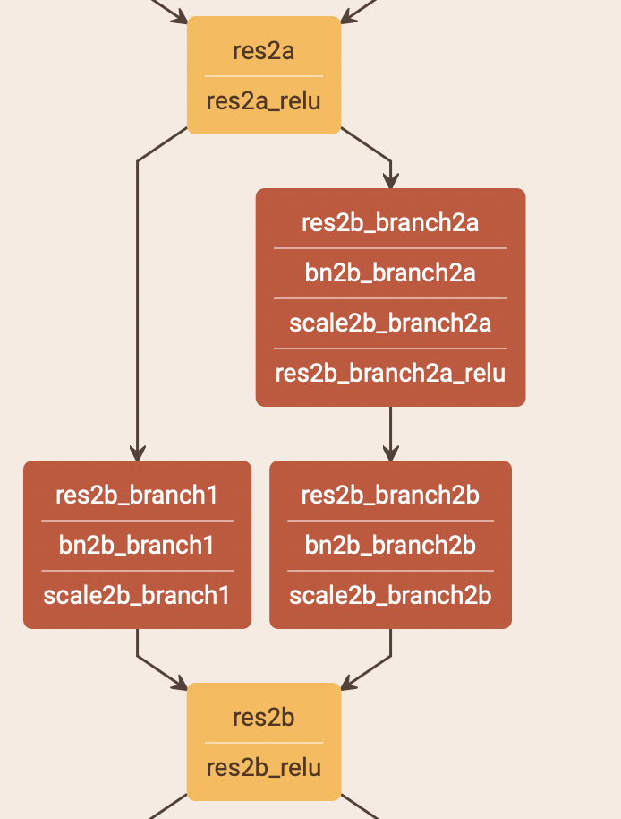
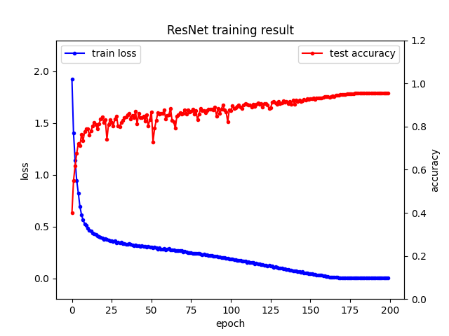
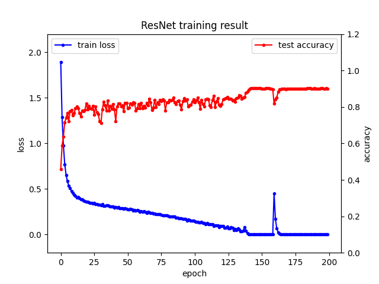
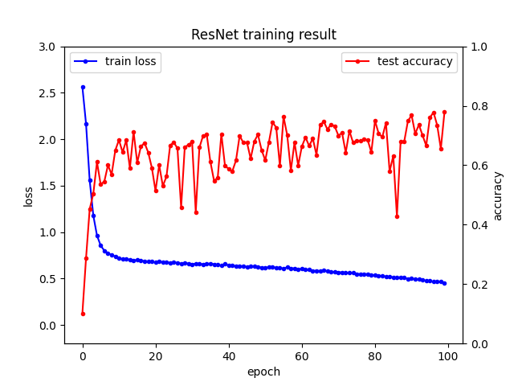
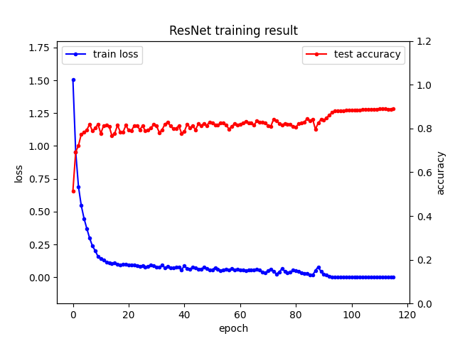
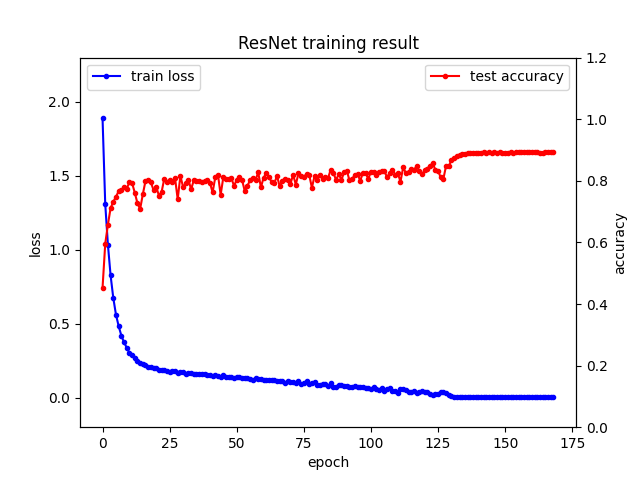
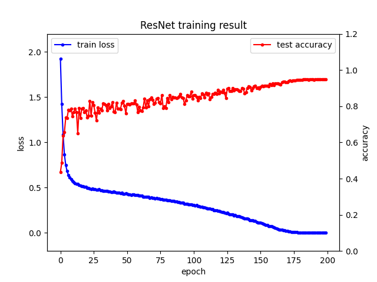

# 基于卷积神经网络的图像分类系统

小组成员：沈玮杭 周嘉豪 陈乐

---


## 数据处理

### 图片预处理

1. 使用`transforms.RandomCrop()`对图片进行随机裁剪，`transforms.RandomHorizontalFlip()`进行随机地水平翻转。这一步的目的是提高模型的泛化性，因为我们希望模型学到的特征并不总是在图片的同一位置或者是同样的大小。
2. 调用`transforms.ToTensor()`来将图片转化为张量，同时把数据范围归一化到(0, 1)
3. 调用`transforms.Normalize()`将数据归一化到(-1, 1)的范围。这一步的目的是使实际的bias接近原点，加快收敛。具体的参数则是根据cifar10数据集的均值和标准差来设置的，其为`transforms.Normalize((0.4914, 0.4822, 0.4465), (0.2023, 0.1994, 0.2010))`。

## 系统设计

### 模型设计

​	一开始我们使用的是基础的CNN模型，但发现网络过浅训练效果不好,准确率只能达到**60%**左右，过深又会碰到梯度消失的问题。于是我们将目光投向ResNet。我们参考了论文中ResNet18的设计。整个网络由13个卷积层和1个全连接层组成。输入数据首先经过1个卷积层，然后是6个BasicBlock，最后通过一个全连接层输出。

​	BasicBlock的设计如下图。由两个卷积层和一个shortcut组成。shortcut的使用能在一定程度上解决梯度消失的问题，得到更好的训练结果。

<div align=center>
	
    <p>
        图1 BasicBlock结构
    </p>
</div>

​	ResNet本身可以支持更深的网络，如ResNet101、ResNet152。但考虑到使用的是cifar10数据集，图像分辨率低，特征少，较浅的网络即可提取出需要的特征，所以我们搭建了ResNet18，其只使用8个BasicBlock。

### 训练方法

* loss的计算使用了`CrossEntropy`。
* 优化器采用了`SGD(Stochastic Gradient Descent)`，这样收敛更快。
* 学习率的衰减使用余弦退火衰减。与指数衰减相比，余弦退火策略不容易陷入到局部最优的情况中。

## 实验结果

### 预测准确率

​    在我们最终搭建的ResNet18网络中，模型在200轮的训练后收敛，最终`accuracy = 95.52%`，`train loss = 0.00169`。而在`epoch=100`时`accuracy = 87.27%`。

### 参数

​	`Learning rate = 0.1`

​	`Batch size = 128`


### 训练过程

   train loss和test accuracy在训练过程中的变化如下：

<div align=center>
    
    <p>
        图2 最终模型（ResNet18）的train loss和test accuracy变化曲线
    </p>
</div>


```
Files already downloaded and verified
Files already downloaded and verified
start training from epoch 0 ...
epoch: 0	train loss: 1.92231		test accuracy: 39.95%
epoch: 1	train loss: 1.40149		test accuracy: 54.98%
epoch: 2	train loss: 1.14067		test accuracy: 61.80%
epoch: 3	train loss: 0.94478		test accuracy: 67.49%
epoch: 4	train loss: 0.82474		test accuracy: 72.16%
...
...
epoch: 98	train loss: 0.19116		test accuracy: 82.21%
epoch: 99	train loss: 0.18844		test accuracy: 87.83%
epoch: 100	train loss: 0.18924		test accuracy: 87.27%
epoch: 101	train loss: 0.18945		test accuracy: 89.53%
epoch: 102	train loss: 0.18267		test accuracy: 88.53%
...
...
epoch: 195	train loss: 0.00162		test accuracy: 95.59%
epoch: 196	train loss: 0.00154		test accuracy: 95.57%
epoch: 197	train loss: 0.00168		test accuracy: 95.61%
epoch: 198	train loss: 0.00178		test accuracy: 95.58%
epoch: 199	train loss: 0.00169		test accuracy: 95.52%
```

   可以看到，`train loss`和`test accuracy`都在175个epoch以后趋于收敛，并且都达到了一个比较理想的状态。

### 调参实验及结果分析
**Version 1:**
       在最开始的时候，我们自己搭建了一个 “ResNet14” 模型，数据先经过一个卷积层，再经过三层layer，每层layer里有两个basic block， 而每个basic block里又有两个卷积层。并且我们在卷积层之间插入了Batch Normalization。最后，经过一个全连接层输出。该模型相比ResNet18少了一个basic block。此模型的其他参数`learning rate = 0.1`, `epoch size = 200`, `batch size = 64`。此外，我们对数据进行了一些预处理，把图片转化成了张量，并且针对cifar10数据集对其进行了normalization：`transforms.Normalize((0.4914, 0.4822, 0.4465), (0.2023, 0.1994, 0.2010))`。此模型最终的结果是:`accuracy = 90.14%`，`train loss = 0.00148`，二者的变化图如下：

<div align=center>
    
    <p>
        图3 ResNet14的train loss和test accuracy变化曲线（learning rate = 0.1, batch size = 64)
    </p>
</div>

**Version 2:**
      我们对上个模型进行了改进，首先，我们把ResNet14增加了一个basic block变成了ResNet18，把三层layer变成了四层layer，把`learning rate`调整成了`0.5`并且增大batch size到`128`，但是很遗憾的是我们在跑了100个epoch以后发accuracy波动非常大，难以收敛，效果较差，我们推测是学习率太大导致的。

<div align=center>
    
    <p>
        图4 ResNet18的train loss和test accuracy变化曲线（learning rate = 0.5, batch size = 128)
    </p>
</div>

**Version 3:**
      我们调小了学习率，将learning rate减小到了`0.05`和`0.1`，发现模型能够收敛了，但很遗憾的是结果并没有比ResNet14好，甚至还有所下降，在`learning rate = 0.05`时`accuracy = 89.01%, train loss = 0.00175`，在`learning rate = 0.1`时`accuracy = 89.95%, train loss = 0.00174`。我们进一步降低了batch size到64，在`learning rate = 0.05, batch size = 64`时`accuracy = 89.96%, train loss = 0.00191`，仍然不够理想。 因此我们想对数据作更多的预处理来提高准确率。

<div align=center>
    
    <P>
        图5-1 ResNet18 learning rate = 0.05，batch size = 128
    </P>
    
  	<p>
        图5-2 ResNet18 learning rate = 0.1，batch size = 128
    </p>
</div>


**Version 4:**
      为了提升accuracy，我们通过对数据进行更多的预处理来进一步提高accuracy，于是我们对图片进行了随机剪切和水平翻转，目的是为了提高数据集的随机性，增强模型的泛化能力。learning rate选择了Version 3中较大的0.1，batch size则保持128。至此，我们的到了我们的最终模型ResNet18，在`learning rate = 0.1, batch size = 128`时`accuracy = 95.52%, train loss = 0.00169`。为了对照，我们对之前ResNet14的模型也做了这些预处理，batch size调到了适合的64，在`learning rate = 0.1, batch size = 64`时，得到结果：`accuracy = 94.79%, train loss = 0.00308`。曲线如下：

<div align=center>
    
    <p>
      图6 ResNet14 数据经过随机裁剪、翻转处理，learning rate = 0.1，batch size = 64
    </p>
</div>


​    可以看到我们的ResNet18相对ResNet14而言准确率提高了`0.73%`，多加一层layer还是有比较好的收益的。并且增加增加训练集数据集随机裁剪和翻转预处理可以将准确率提高约`5%`，收益非常大。

**Version 5:**
      我们进一步探索了改进模型来提高accuracy的可能性，自己搭建了一个 “ResNet28“ 网络。Tensors首先经过一个卷积层，然后做一次Batch Normalization，然后再依次经过basic block layer -> bottleneck layer -> basic block layer -> bottleneck layer，最后经过一个全连接层输出。其中basic block layer与之前的保持一致，bottleneck layer里有三个bottleneck，一个bottleneck由三个卷积层和三次Batch Normalization交替组成，与ResNet56中的bottleneck一致。设置参数为`learning rate = 0.1, batch size = 128`，在数据经过和不经过随机裁剪和水平翻转预处理两种情况下分别进行训练。在数据未经随机处理的情况下得到`accuracy = 88.39%, loss = 0.00136`，数据在经过随机裁剪和水平翻转的情况下，`accuracy = 94.72%, loss = 0.00171`。训练出来的结果并不是很理想，相比ResNet18甚至略有退步。

<div align=center>
    
    <p>
        图7-1 ResNet28，数据未经过随机预处理
    </p>
    
    <p>
        图7-2 ResNet28，数据经过随机裁剪和水平翻转预处理
    </p>
</div>


### 总结分析

   我们认为出现version 5情况的原因可能是因为CIFAR10数据集分辨率小，特征少，包含的特征用ResNet18就能学习到这些特征了，所以多加层数收效甚微，甚至更加容易出现过拟合的状况，所以我们用ResNet18来当作我们的最终模型。

### 参数量

最终模型（Version4中的ResNet18）：（ResNet14和ResNet28见resnet.py）

```python
class BasicBlock(nn.Module):
    def __init__(self, in_channels, out_channels, stride):
        super(BasicBlock, self).__init__()
        self.conv1 = nn.Conv2d(in_channels, out_channels, kernel_size=3, stride=stride, padding=1, bias=False)
        self.bn1 = nn.BatchNorm2d(out_channels)
        self.conv2 = nn.Conv2d(out_channels, out_channels, kernel_size=3, stride=1, padding=1, bias=False)
        self.bn2 = nn.BatchNorm2d(out_channels)
        if stride != 1:
            self.shortcut = nn.Sequential(
                nn.Conv2d(in_channels, out_channels, kernel_size=1, stride=stride, padding=0, bias=False),
                nn.BatchNorm2d(out_channels)
            )
        else:
            self.shortcut = nn.Sequential()

    def forward(self, x):
        out = F.relu(self.bn1(self.conv1(x)))
        out = self.bn2(self.conv2(out))
        out += self.shortcut(x)
        out = F.relu(out)
        return out


class ResNet18(nn.Module):
    def __init__(self, label_num=10):
        super(ResNet18, self).__init__()
        self.conv1 = nn.Conv2d(3, 64, kernel_size=3, stride=1, padding=1, bias=False)
        self.bn = nn.BatchNorm2d(64)
        self.layer1 = self.new_layer(64, 64, 1)
        self.layer2 = self.new_layer(64, 128, 2)
        self.layer3 = self.new_layer(128, 256, 2)
        self.layer4 = self.new_layer(256, 512, 2)
        self.linear = nn.Linear(512, label_num)

    def new_layer(self, in_channels, out_channels, stride):
        return nn.Sequential(
            BasicBlock(in_channels, out_channels, stride),
            BasicBlock(out_channels, out_channels, 1)
        )

    def forward(self, x):
        x = F.relu(self.bn(self.conv1(x)))
        x = self.layer1(x)
        x = self.layer2(x)
        x = self.layer3(x)
        x = self.layer4(x)
        x = F.avg_pool2d(x, 4)
        # flatten
        x = x.view(x.size(0), -1)
        x = self.linear(x)
        return x
```

其他参数：

```python
learning_rate = 0.1
epoch_size = 200
batch_size = 128

# prepare dataset
train_transform = transforms.Compose([
    transforms.RandomCrop(32, padding=4),
    transforms.RandomHorizontalFlip(),
    transforms.ToTensor(),
    transforms.Normalize((0.4914, 0.4822, 0.4465), (0.2023, 0.1994, 0.2010)),
])
```


参考文献：
- [1] Kaiming He and Xiangyu Zhang and Shaoqing Ren and Jian Sun. Deep Residual Learning for Image Recognition. 2015.
- [2] kuangliu/pytorch-cifar (https://github.com/kuangliu/pytorch-cifar)